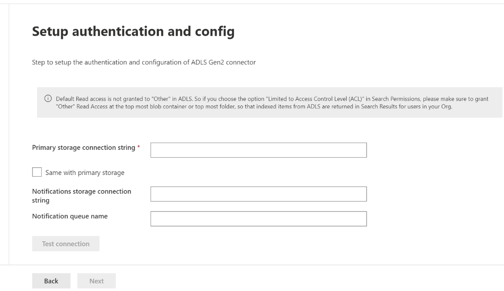
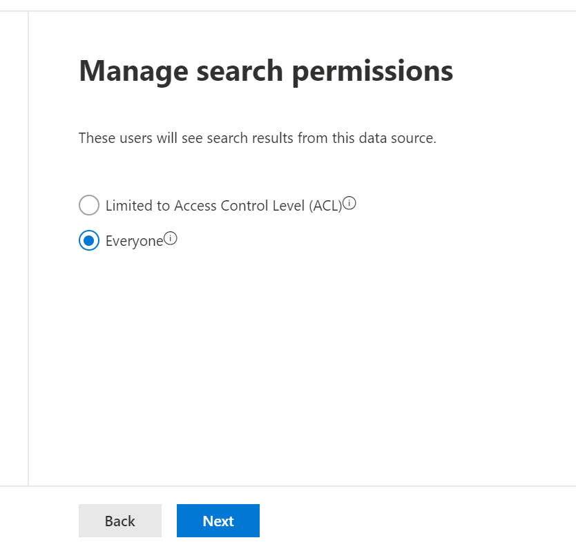

# Configure an Azure Data Lake Storage Gen2 connector in Microsoft 365

With the [Azure Data Lake Storage Gen2](https://docs.microsoft.com/azure/storage/blobs/data-lake-storage-introduction) connector for Microsoft Search, users in your organization can search for files and their content. This connector accesses data stored in Azure Blob containers and hierarchy-enabled folders within an Azure Data Lake Storage Gen 2 account.

This article is for Microsoft 365 administrators or anyone who configures, runs, and monitors an Azure Data Lake Storage Gen2 connector for Microsoft Search. It explains how to configure your connector and connector capabilities, limitations, and troubleshooting techniques.

## Connect to a data source

### Primary storage connection string 
On the **Authentication and config** screen, provide the Primary Storage Connection String. That string is required to allow access to your storage account. To find your connection string, go to the [Azure portal](https://ms.portal.azure.com/#home) and navigate to the **Keys** section of the Azure Data Lake Storage Gen2 account. Copy and paste the connection string in the appropriate field on the screen.

If you do not want to provide the **AccountKey** (a parameter in the primary storage connection string), you have to grant read access to our Graph Connectors Service. In the **Access Control** tab of your Azure Data Lake Storage Gen2 account, follow the instructions on that page to grant access to the following app:
    First Party App ID: 56c1da01-2129-48f7-9355-af6d59d42766
    First Party App Name: Graph Connector Service

### Storage account and queue notifications (Optional)
Support to process changes in real time in the Graph Connectors Service might be added in the future. In that case, we'll monitor Azure Data Lake Storage Gen2 change notifications stored in a queue. You'll need to create a queue in the same account as your Azure Data Lake Storage Gen2 or in another storage account.

After you create a queue, go to the **Events** tab in the queue page to configure Event Subscription. Choose all the Blob events that the queue will receive and connect the queue to the Azure Data Lake Storage Gen2 account.

## Manage the search schema
On the **Manage Schema** screen, you have the option to change the schema attributes (**queryable**, **searchable**, and **retrievable**) associated with the managed properties. These managed property attributes are data indexed from your Azure Data Lake Storage Gen2 account.

## Manage search permissions
On the **Manage search permissions** screen, you can choose to ingest the Access Control Lists (ACLs) from your storage account. When these search permissions are set, search content is trimmed based on the permissions assigned to the signed-in Azure AD user searching the content. Alternatively, you can choose to make all the content indexed from your storage account visible to everyone in your organization. In this case, everyone in your organization will have access to all the data in your storage account.

 
## Set the refresh schedule
On the **Refresh Settings** screen, you can set the incremental crawl interval and the full crawl interval. The default intervals for the Azure Data Lake Storage Gen2 connector are 15 minutes for an incremental crawl and one week for a full crawl.
 
## Limitations
Currently, Azure Data Lake Storage Gen2 Multi-Protocol Access is available only in the Central US, West Central US, Canada Central, East US, East Asias, North Europe, East US2, South East Asia, West Europe, West US, Australia East, Japan East, West US2, and Brazil South.

For updates and more information, see  [Multi-protocol access on Azure Data Lake Storage (preview)](https://docs.microsoft.com/en-us/azure/storage/blobs/data-lake-storage-multi-protocol-access).

