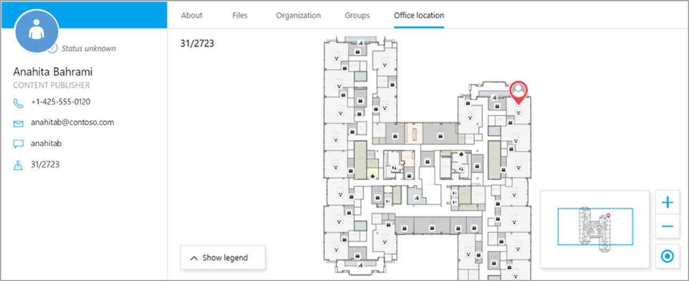
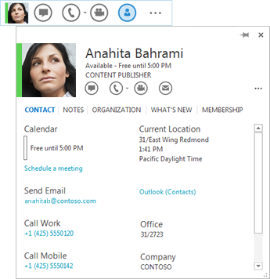
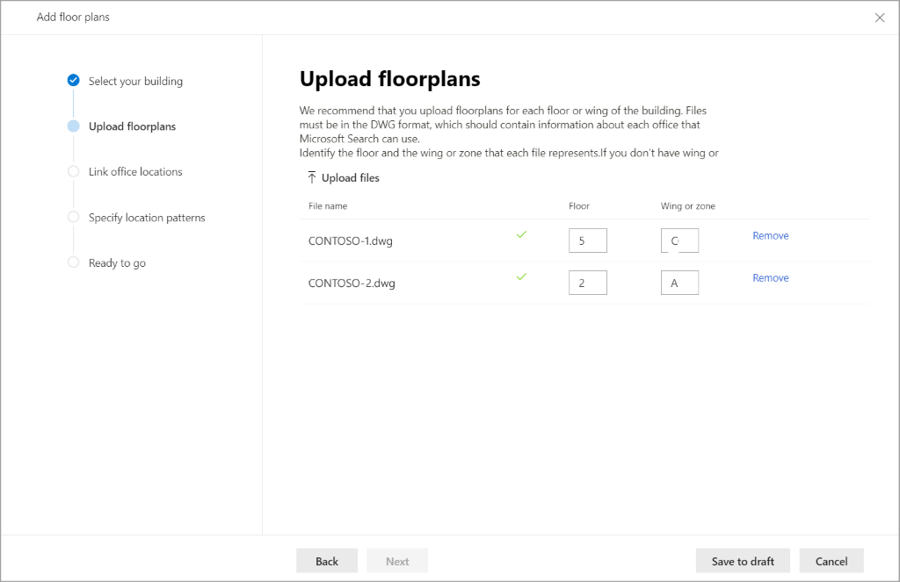

# Manage floor plans

  

*Figure 1 – Office location isn’t just a number with Microsoft Search.*

The floor plans feature in Microsoft Search helps users find people and meeting rooms within a building. Floor plans answer users' queries such as:

1. Where is Allan Deyoung's office?
2. Where is meeting room C1?

To make it easy to find answers to queries like these, information about an organization's buildings, offices, and facilities needs to be available and made searchable. Larger organizations usually have facilities or space management teams who may already have this info available. In a smaller organization, the Search Administrator might have to create and add it. A Search Administrator can delegate this work and allow other employees or vendors to add floor plans and building information by designating them as Search Editors in the M365 admin center.
To enable users to find information about offices and building facilities, you need to add:

1. Information about a building such as name, street address, lat-long
2. Floor plans for each floor in a building in Autodesk DWG format
3. Employee seat info in Azure Active Directory (AAD) Office field. The seat info should follow a standard format and include building, floor and room info.

 

*Figure 2 – The office location data is defined in AAD as employee seat numbers.*

The field in AAD where seat numbers are stored is called ‘Office Location’.

### Step 1: Buildings and locations

Identify the buildings that need to be added as locations. The location address and map coordinates of a building are the first point of identification, and floor plans are associated with the building. If the building location (address) is already in AAD, the Search Administrator just needs to search for the building name in the floor plan setup and select it. If the building is not yet added as a location, the admin needs to add it. See [Manage Locations](manage-locations.md) for more details.

### Step 2: Floor plans

Once a building is identified, you can add its floor plans. All floor plans must be in DWG format. If your organization doesn't already have them, you'll need to create the floor plans in AutoCAD or another DWG-compatible app. Floor plans must correctly map all rooms, including conference or meeting rooms, restrooms, kitchens, mailrooms, and other facilities on each floor of the building to enable search.

### Step 3: Unique identification codes

Each building should have a unique identification code. Buildings, floors, wings, and room numbers are used to uniquely identify office locations in AAD. You must use only one standardized pattern to define the office locations in a building.

For example, your organization might standardize on a pattern where the first character identifies the building (A), followed by a number identifying the floor (1), and then a three-digit number identifying a room (119). 

In this example, A1/119 would uniquely identify room 119 on the first floor of Building A and B2/309 would uniquely identify room 309 on the second floor of Building B.
Whichever numbering system you decide upon needs to be followed consistently for all rooms, floors, and buildings of your organization.

*Figure 3 – Office floor plan search*

### Step 4: Personnel and office data in AAD

All office locations and employee office data must be stored in AAD in order to be mapped to floor plans. All office locations must have unique values; that is, two or more people may sit in an open area that has an office location ID of B1/0001, but B1/0001 is a unique location and there is no other location with the same code in AAD.

 **Note:** When a user searches for a room or office location of a colleague, the room numbers in floor plans are matched with office locations in AAD. If a match is found, then the floor map is shown.
It can take several hours for new or changed floor plans to appear in search results.

## Add floor plan

  

*Figure 4 – Specify the Floor and Wing or Zone that each file represents.*

1. Log in using your admin credentials and go to Microsoft 365 admin center.
2. In the navigation pane, go to Settings and select Microsoft Search.
3. Select Floor plans tab.
4. Select Add floor plans to open the Add floor plans dialog.
5. Select the building in the drop-down and select Next. If the building is not listed in the dropdown, you can add it as a new location. See [Manage Locations](manage-locations.md) for more info.
6. Select Upload files and select the floor plan you want to upload. All floor plans must be in DWG format. You can upload multiple floor plans at the same time. After the file is uploaded, identify the floor and/or wing in the building that the floor plan is for.  

If a floor plan cannot be uploaded, an error messages should identify the issue and solution. For troubleshooting DWG file upload issues, see the Troubleshoot Errors section. The Next button will be disabled until all floor plans are successfully uploaded.

  

*Figure 5 – Specify the office location that’s related to the seat numbers you assigned.*

7. Link office locations requires the building code. The building code can be found in the AAD office location of an employee. For example, if the office location is 31/2773 then building code is 31. If the office location is, say, CITY CENTER 21009 then building code is CITY CENTER. Building codes can be found in the AAD profile of a person who sits in that building.
8. Next, specify the location nomenclature. Here you define what each of the different characters or numbers in the code identifies. For example, the building code PS35/13/0124 identifies a building name and number (PS35), followed by a floor number (13th floor), and finally, the room number (0124). Microsoft Search tries to extract the pattern and displays it for confirmation. The Search Admin can determine the pattern by looking at the location information for an employee in the address card.
9. After associating a building with an AAD location and specifying location patterns for all uploaded floor plans, select Publish to add to the floor plans. Or you can save the plans as a draft for publishing later.

*Figure 6 – When mapping is complete, you’re ready to go*

 **Note:** A draft is a building for which floor plans or mapping is incomplete. A draft enables multiple people such as IT admins, business admins, and facility management teams to coordinate in uploading and creating floor plans. It also allows users to upload floor plans in stages.

10. In the Floor plans tab on the Microsoft Search home page, the published or saved draft floor plans are listed under Published or Draft.

## Edit floor plan

1. Log in using your admin credentials and go to Microsoft 365 admin center.
2. In the navigation pane, go to Settings and select Microsoft Search.
3. Select the Floor plans tab. The existing floor plans are listed under Published or Draft.
4. Select the floor plan you want and click Edit.
5. Edit the details and floor plans and save.

 **Note:** The draft facility is not available once the building is published. A Search Editor can still edit a published building, but they cannot make partial changes and save it to draft. They need to make the changes in one session. Any changes saved are shown in the Office tab in the People card in Microsoft Search. A Search Editor can choose to unpublish a building, in which case the building is moved to the Drafts section and the details are not shown in the Office location tab.

## Troubleshoot errors

A Search Administrator cannot proceed to the next step of defining floor, wing, and room information until all errors are fixed. Here's a list of DWG file upload error messages and actions for fixing the issues.

| Error message   | Type    | Action       |
|:----------------| :--------- | :-------------- |
| Unable to read CC_1.dwg. Please re-upload or delete the floor plan. | Error |  Reupload or delete |
| There are two files named CC_1.dwg. Please delete one of them or re-upload with another name.| Error | Reupload, delete or add wing/section information |
| No data found. | Error | Reupload or delete |
| External references are missing in this file. Either upload "CC_1_furniture.dwg" or delete this file. | Warning | Upload external reference files or delete |
| Could not read room numbers or tags in the DWG file. Please delete  this file. | Warning | Reupload or delete |
