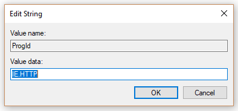
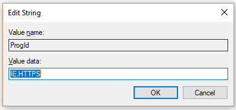

# Make Microsoft Edge the default browser
  
To give your users the best experience with Microsoft Search, you can make Microsoft Edge the default browser. This will only set Microsoft Edge as the default browser for users in your org, individual users can still select a different browser.
  
  
## Windows 8 and later

These instructions show you how to make Microsoft Edge or Internet Explorer as the default browser for computers running Windows 8 or later. Users will be able to change the browser after this policy is set.
  
### STEP 1: Create the default associations file
Create the default associations file in the SYSVOL folder of the domain controller.

1. Open an administrative PowerShell console.
1. `New-Item -Path "\\$env:USERDOMAIN\SYSVOL\$env:USERDNSDOMAIN" -Type Directory -Name "Settings"`
1. `$SettingsPath="\\$env:USERDOMAIN\SYSVOL\$env:USERDNSDOMAIN\Settings"`
1. `Start-Process Dism.exe -PassThru "/Online /Export-DefaultAppAssociations:$SettingsPath\AppAssoc.xml"`
    
  
### STEP 2. Add or edit the default associations file

1. `Notepad "$SettingsPath\AppAssoc.xml"`
1. Edit the following entries (.htm, .html, http, https), and remove other entries if they're not needed.
  - **Microsoft Edge**
    - `<Association Identifier=".htm" ProgId="AppX4hxtad77fbk3jkkeerkrm0ze94wjf3s9" ApplicationName="Microsoft Edge" />`
              
    - `<Association Identifier=".html" ProgId="AppX4hxtad77fbk3jkkeerkrm0ze94wjf3s9" ApplicationName="Microsoft Edge" />`
    - `<Association Identifier="http" ProgId="AppXq0fevzme2pys62n3e0fbqa7peapykr8v" ApplicationName="Microsoft Edge" />`
    
  - **Internet Explorer**
    
    - `<Association Identifier=".htm" ProgId="htmlfile" ApplicationName="Internet Explorer" />`        
    - `<Association Identifier=".html" ProgId="htmlfile" ApplicationName="Internet Explorer" />`
    - `<Association Identifier="http" ProgId="IE.HTTP" ApplicationName="Internet Explorer" />`
    - `<Association Identifier="https" ProgId="IE.HTTPS" ApplicationName="Internet Explorer" />`

### Step 3. Edit the Group Policy

1. Open **Group Policy Management Console** (gpmc.msc) and switch to editing any existing policy or creating a new one.
1. Navigate to **Computer Configuration\Administrative Templates\Windows Components\File Explorer**.
1. Double-click **Set a default associations configuration file**, set it to **Enabled**, and enter the path to AppAssoc.xml (for example %USERDOMAIN%\SYSVOL\%USERDNSDOMAIN%\Settings\AppAssoc.xml) Enforce the resultant GPO by linking it to the appropriate domain.

  
## Windows 7

1. Configure the local machine that will be used to set the GPO.
    
1. Open **Control Panel\Programs\Default Programs\Set Default Programs** and set Internet Explorer as the default. 
    
2. Open Group Policy Management Console (gpmc.msc) and switch to editing any existing policy or creating a new one.
    
1. Navigate to **\<Computer/User\> Configuration\Policies\Preferences\Windows Settings**.
    
2. Right-click on **Registry\New** and select **Registry Wizard**.
    
3. From the Registry Browser window, select **Local Computer** and click **Next**.
    
4. Navigate to **HKEY_CURRENT_USER\Software\Microsoft\Windows\Shell\Associations\UrlAssociations\https** and select the ProgId value. Make sure the value looks like the one below: 
    
    
  
5. Navigate to **HKEY_CURRENT_USER\Software\Microsoft\Windows\Shell\Associations\UrlAssociations\https** and select the ProgId value. Make sure that the value looks like the one below: 
    
    
  
3. Enforce the resultant GPO by linking it to the appropriate domain.
    
